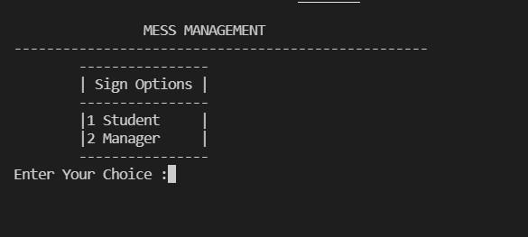
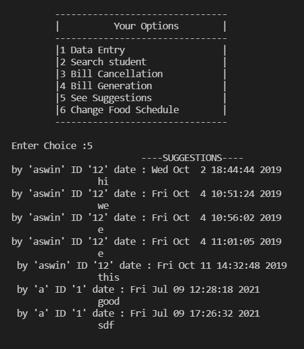

# Mess Management System
## Two logins are there one ADMIN, USER(student)
Admin Id | ADMIN
---------|---------
Password | 1!2@3#4$

In this system one admin and n users available.

Users information are stored in file system. 

Sample I/O
---
### Manager
.

.

.

.

.

.
### Student
.

.

.

.

